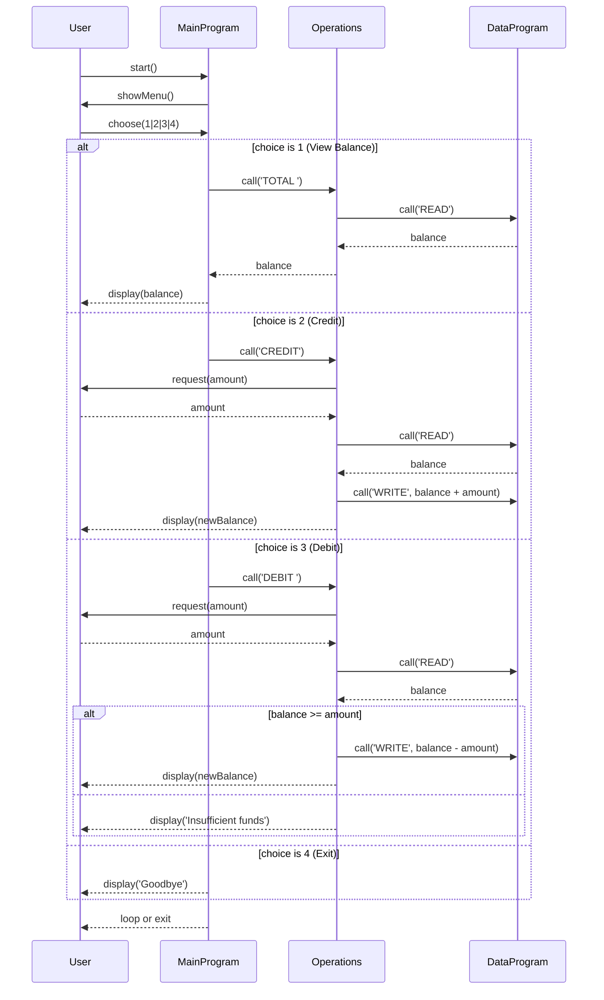

# School Accounting System (COBOL) Documentation

## Overview
This repository (`Lab-4`) contains a small school accounting system implemented in COBOL with a modular program structure.

Components:
- `src/cobol/main.cob` (UI/Menu controller)
- `src/cobol/operations.cob` (business logic)
- `src/cobol/data.cob` (data persistence emulation)

## Business Requirements
1. Provide a menu-driven command-line interface (CLI) for account operations.
2. Support viewing current account balance.
3. Support credit (deposit) operation with amount input.
4. Support debit (withdrawal) operation with insufficient-funds validation.
5. Maintain current balance state across operations within session.
6. Exit cleanly on user command.

## Key Functions and Flow

### `main.cob`
- Entry point program (`Program-ID. MainProgram`).
- User menu choices:
  - `1`: View Balance
  - `2`: Credit Account
  - `3`: Debit Account
  - `4`: Exit
- Uses `EVALUATE` on `USER-CHOICE`.
- Calls `Operations` program with operation code `'TOTAL '`, `'CREDIT'`, `'DEBIT '`, or sets loop flag to exit.

### `operations.cob`
- Program ID: `Operations`.
- Receives operation type via linkage parameter.
- Logic:
  - `TOTAL`: calls `DataProgram` with `'READ'`; displays balance.
  - `CREDIT`: input amount; read existing balance; add amount; write updated balance; show success.
  - `DEBIT`: input amount; read balance; check funds; subtract and write if OK; else show error.
- Handles business flow and validation.

### `data.cob`
- Program ID: `DataProgram`.
- `STORAGE-BALANCE` is initial value `1000.00` in working storage.
- Implements persistence API using CRUD-like flags:
  - `'READ'`: populate passed `BALANCE` with current `STORAGE-BALANCE`.
  - `'WRITE'`: update `STORAGE-BALANCE` from passed `BALANCE`.
- Simple in-memory state store for a single session.

## Setup and Usage
1. Compile COBOL sources with your COBOL compiler (e.g., `cobc`):
   - `cobc -x -o main src/cobol/main.cob src/cobol/operations.cob src/cobol/data.cob`
2. Run executable:
   - `./main`

## Notes
- The system is designed for educational/demo purposes and currently uses in-memory state; persistence across process restarts is not implemented.
- No transaction history or multi-user support is present.

## Sequence Diagram (Mermaid)

